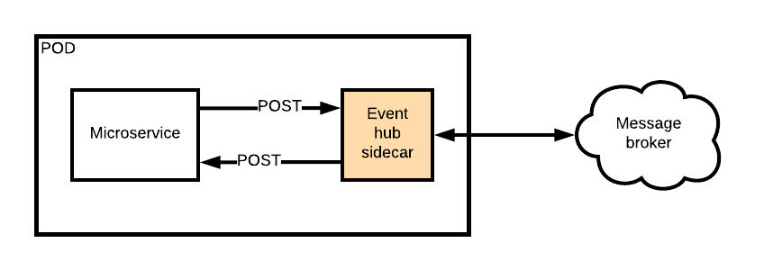

# event-hub-sidecar

The event hub sidecar is designed to connect microservices to message brokers by subscribing to queues and topics and posting events to the microservice via http. This pattern frees up the microservice from having to connect to message brokers and allows them to be just pure REST APIs, increasing the speed at which the can be built and deployed.

This sidecar is used in conjunction with the Event Hub to provide a simple and powerful eventing mechanism to drive your choreographed microservice architecture.

The below diagram explains the way the events flow:

Events are delivered via a POST http request to an endpoint which needs to be exposed by the microservice, the body of which contains the event object in JSON. Events can be published by the microservice by making its own POST to the event hub sidecar, which will then send the event on to the message broker.

If the microservice is unavailable or responds with an error, the event can be re-queued on the message broker for redelivery, or the sidecar can try to deliver the event a few more times before failing.

Finally the sidebar will provide detailed logging to help debug issues that can be hard to track when using a distributed and asynchronous architecture.

The event hub sidecar will eventually work with:

* ActiveMQ (Amazon MQ)
* AWS SNS/SQS
* Azure Service Bus
* GCP Cloud Pub/Sub
* RabbitMQ